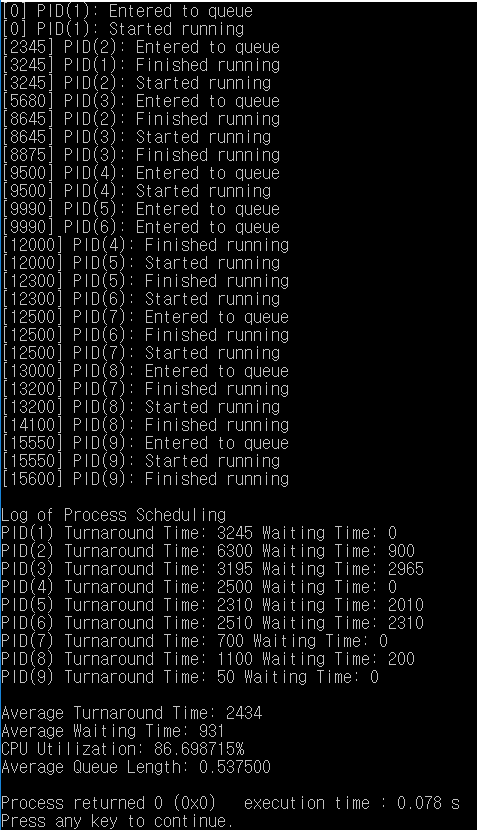

# FCFS
#### An implementation of First-Come-First-Served(FCFS) scheduling in C  
  
### Description  
This implementation is FCFS scheduling simulation. This source reads a file containing process #,
arriving time, and execution time. Using this info, the program enqueues the process at its arrival time,
dequeues in order, and finishes one process after its execution time, until all processes are terminated.
After showing this process, you can see each turnaround time, each waiting time,
average turnaround time, average waiting time, CPU utilization, and average queue length as well.  
  
### Input  
"process.txt" includes the total number of processes at the first line, and 
the lines of (process id, arrival time, execution time). It assumes the lines are ordered by arrival time.  
&nbsp;  

